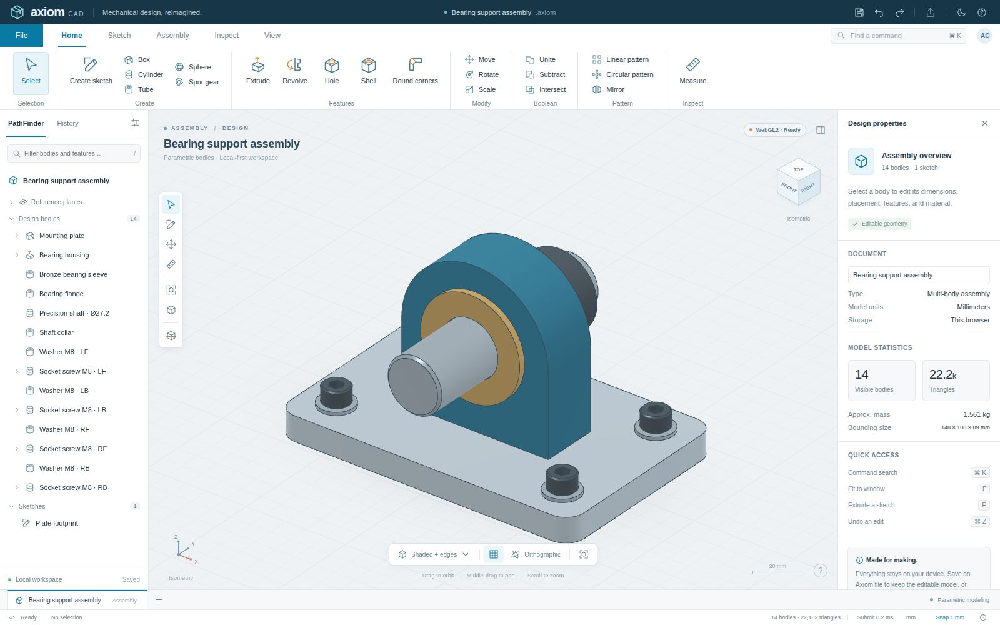

# Axiom CAD

**[Launch Axiom CAD](https://wieslawsoltes.github.io/AxiomCAD/)** · [Deployment documentation](docs/DEPLOYMENT.md)

**A local-first, framework-free mechanical CAD workbench.**

Axiom uses the familiar desktop mechanical-CAD arrangement: a command ribbon, PathFinder-style model tree, central 3D viewport, steering handles, view cube, and an editable property inspector. The interface, icons, branding, models, geometry code and renderer are included in this source distribution.

This is a working **polygonal CAD implementation**, not a static interface mockup and not a complete replacement for Solid Edge. See the explicit scope boundaries below.



## Run

Node.js 20 or newer is sufficient. There are **no npm dependencies to install**.

```sh
npm start
```

Open the loopback URL printed in the terminal, normally `http://127.0.0.1:8080`.

The app initially opens a fully editable 14-body bearing support assembly. Select **Mounting plate** in PathFinder and change its width in Design properties. The geometry, holes, technical edges and mass estimate regenerate. Undo restores the previous model.

For the single-file distribution, serve `dist/axiom-cad.html` on localhost or HTTPS. The file includes its CSS, JavaScript, WGSL, GLSL, sample models, icons and worker source. It requires no CDN assets. Opening it directly as a file may use the WebGL2 fallback depending on browser security and graphics availability.

The viewport badge reports the backend actually selected. WebGPU is attempted first; WebGL2 is an explicitly labeled fallback. The app does not substitute a bitmap or software 2D illustration for the model.

WebGPU requires a secure context; localhost is suitable for local development. Official references: [W3C WebGPU specification](https://www.w3.org/TR/webgpu/) and [Chrome troubleshooting guidance](https://developer.chrome.com/docs/web-platform/webgpu/troubleshooting-tips).

## Implemented workflows

| Area | Working functionality |
| --- | --- |
| Solids | Editable boxes, rounded boxes, cylinders/frustums, tubes, spheres and stylized gear bodies |
| Sketches | XY/XZ/YZ reference planes; dragged rectangles and circles; closed polylines; snapped points; vertex dragging; profile width/height editing |
| Features | Associative sketch extrusion; closed R–Z profile revolution, including partial sweeps; cylindrical holes on body-local X/Y/Z axes; open-top box shells; vertical box-corner rounds; cylinder-rim chamfers |
| Boolean operations | Polygonal union, subtraction and intersection of two selected bodies; selection order determines target/tool; operands remain preserved and hidden |
| Editing | Body picking, multi-selection, direct parameter edits, move steering axes, free-plane dragging, numeric position/rotation/scale, material/color changes, feature suppression/removal, undo/redo |
| Assemblies | Independent cloned bodies, linear/circular patterns, mirror features, visibility, isolation and non-destructive exploded presentation |
| Inspection | Surface-point distance measurement; bounding dimensions; approximate volume, area and assigned-material mass; horizontal clipping with section contours; wireframe and translucent X-ray views |
| Files | Axiom JSON import/export; ASCII/binary STL import; binary STL export; OBJ import/export; PNG viewport capture; three-view SVG wireframe export |
| Workspace | Light/dark themes, ribbon tabs, command search, tree filtering, view presets, orbit/pan/cursor-anchored zoom, grid, millimeter/inch display and local autosave |

### A quick modeling sequence

Choose **File → New document**, then **Create sketch**. Drag a rectangle on the XY plane. Choose **Extrude**, enter a distance, and apply. Select its source sketch in PathFinder and change its width or height: the extrusion remains associated with the profile. Select the solid, choose **Hole**, and enter a cutter radius, start coordinates, drilling axis and depth. Export the result as an editable Axiom document or a triangulated STL/OBJ file.

Sketch dimensions scale the profile about its center; they are not constraints. A circle is represented as a polygonal approximation. Positive extrusion direction is plane-dependent: XY → +Z, XZ → −Y, YZ → +X. Hole cutters use the body's local coordinates and extend along the selected positive axis. Start outside the body and use sufficient depth for a through hole.

**Round corners** applies to parametric box footprints. **Chamfer** is available through command search for cylinder rims. Neither command is a general-purpose arbitrary-edge finishing operation.

Boolean and mirror features store operand snapshots. Editing their original source bodies later does not change the result. Undo recovers the previous state. Cloned extrusion bodies may still reference the same source sketch; editing that shared sketch updates its linked extrusions.

## Navigation and shortcuts

| Interaction | Action |
| --- | --- |
| Left-click / Shift-click | Select / extend body selection |
| Drag empty space or right-drag | Orbit |
| Middle-drag or Shift-right-drag | Pan |
| Wheel | Zoom anchored at the cursor |
| V / S / E / H / M / D | Select / sketch / extrude / hole / move / measure |
| F / 0 / 1 / 2 / 3 | Fit / isometric / front / top / right |
| C / W / G | Section / wireframe / grid |
| Ctrl or Cmd + K | Command palette |
| Ctrl or Cmd + Z / Shift+Z | Undo / redo |
| Ctrl or Cmd + S / O / D | Save / open / duplicate |
| Delete / Space | Delete / toggle visibility |
| Enter in a polyline | Close the profile |
| Escape | Cancel tool, clear selection and reset inspection presentation |

Geometry is always stored in millimeters. Display units only change numeric presentation and how subsequent user-entered lengths are interpreted. STL/OBJ imports prompt for source units.

## Architecture

The DOM handles only the application chrome and SVG interaction overlays. Actual model surfaces, technical edges, ground grid and section contours are rendered on the graphics canvas.

`src/geometry.js` is a pure JavaScript polygonal solid kernel. `geometry-worker.js` runs tessellation, BSP CSG, mesh metrics and technical-edge extraction off the main thread, then transfers typed-array buffers back to the UI. Revision numbers discard outdated worker results. A timeout terminates excessively costly jobs; Undo allows recovery. Failed or outdated geometry cannot silently be exported as the current valid model.

`src/renderer.js` contains the native WebGPU implementation and its own separate WebGL2 implementation. Both share the geometry representation. The WebGPU path uses WGSL, 4× multisampling, depth-tested technical edges, simple metallic/roughness shading, a 128-byte scene uniform and 48-byte interleaved vertices. GPU buffers persist between geometry changes. Frames are requested on demand rather than through an unconditional animation loop. Float64 CPU camera math narrows to float32 only at GPU upload.

Model geometry is generated on the CPU, not by compute shaders. Geometry/material/preview changes currently repack the scene batch. This is suitable for small-to-medium interactive concept models but is not a million-part assembly engine. The status bar's **Submit** number measures CPU submission time, not GPU execution time or FPS.

See [ARCHITECTURE.md](docs/ARCHITECTURE.md) for contracts, data flow and extension boundaries.

## Build and test

```sh
npm test
npm run build
```

The build creates `dist/axiom-cad.html`. The build itself uses only Node built-ins. The readable ES modules remain the source of truth.

For browser integration tests, separately install Python Playwright and use a Chromium executable available on your machine. Start the development server, then run:

```sh
python3 tests/browser.py --url http://127.0.0.1:8080 --chromium /path/to/chromium
```

The supplied inline mode exercises the standalone artifact without browser navigation:

```sh
python3 tests/browser.py --inline --chromium /path/to/chromium
```

Recorded validation: **36 Node tests and 40 browser integration checks passed**. The browser suite used Chromium 144 and real WebGL2 through SwiftShader. Native WebGPU execution, browser-origin storage persistence, and the platform's file-download UI were **not verified in this environment**. The suites do verify exported mesh payloads, native JSON reload, generated SVG, and actual-canvas PNG capture. The native WebGPU code is included but its WGSL compilation, GPU pipeline creation and presentation require validation on a WebGPU-enabled browser/device.

See [TEST-REPORT.md](docs/TEST-REPORT.md), raw unit output and the browser JSON report for the exact evidence. No hardware GPU throughput claim is made.

## Scope and safety boundaries

There is no Parasolid, Open Cascade or other exact analytic B-rep kernel. Native Solid Edge `.par`, `.asm` and `.psm` files and STEP/IGES are not supported. There is no NURBS modeling, geometric constraint solver, assembly mating solver, arbitrary-edge filleting, loft/sweep system, sheet-metal unfolding, FEA, CAM or manufacturing certification.

CSG is floating-point polygonal BSP. Difficult coplanar, near-degenerate or highly fragmented inputs can fail or produce unsuitable topology. Imported meshes are not repaired or certified watertight. Volume and mass estimates can be unreliable for open, self-intersecting or inconsistent meshes. Overlapping bodies are summed, not automatically united. Material densities are approximate presets. The gears use stylized trapezoidal teeth, **not an involute manufacturing profile**.

Section clipping removes the displayed geometry above the selected horizontal plane without changing the source design. The rendered cut is **uncapped** and includes intersection contour lines. X-ray transparency is approximate and not order-independent. SVG output is a concept wireframe drawing: views are fitted independently, hidden lines are not removed, and it is not a scaled engineering drawing.

Imports are capped at 30 MiB and 250,000 mesh triangles. Documents support up to 512 bodies, 256 sketches, 2,048 profile points and 64 per-body features. Boolean inputs have a 22,000-polygon guard and nesting/depth limits. These are protective bounds, not performance guarantees. Large model snapshots can exceed browser storage; the UI then says **Save a file**. Save native JSON files for durable work.

The app has no accounts, telemetry, cloud modeling, external fonts, runtime package downloads or network model processing. Local storage is browser- and origin-specific; it is not a substitute for a saved document.

## License

MIT for the included code. Independently branded and implemented; not affiliated with or endorsed by Siemens. Solid Edge is referenced only to describe the requested workflow inspiration.
